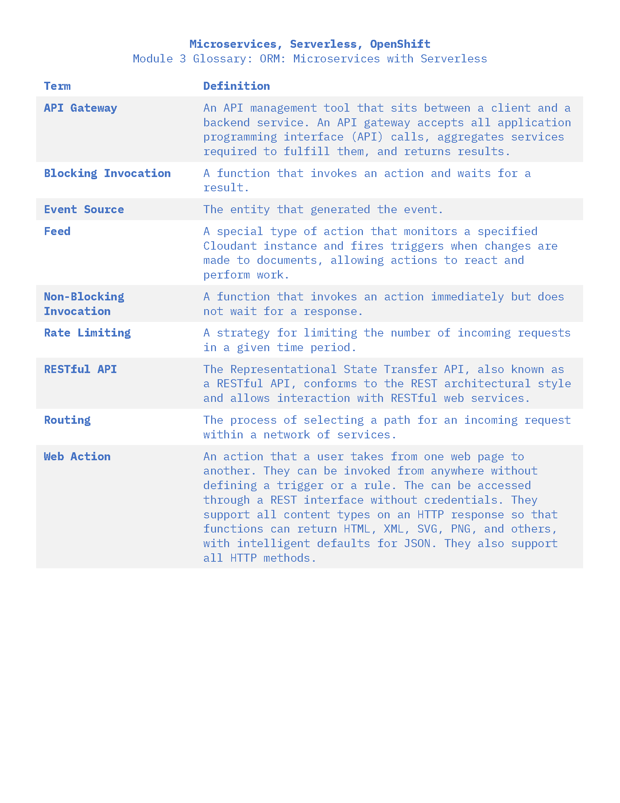

# Microservices with Serverless

## Creating and calling Actions

One can create an action and pass a node.js script into ibmcloud
```
ibmcloud fn action create hello hello.js
```

To list the actions you have on ibmcloud do:
```
ibmcloud fn action list
```

## Blocking vs Non Blocking invokation

Blocking waits for a response and non blocking does not wait for a response. When an action is called, you can either call an action as blocking or nonblocking

When either type of invoke is made, an activation record is stored with the response that can be called down and used later

When calling an action you can pass in parameters, or use a json file and pass it to the action within the command line

You can also set default parameters if no value is set

## Sequence actions

- Sequences are created based on actions already created 
- Sequences are just actions that are composed of chained actions

## Triggers and rules

A trigger is a named channel for a class of event
Triggers can be fired by a user or an external event

Rules associates one trigger with one action

## Glossary Terms


Rules are automatically enabled when they are created
Rules causes actions to be triggered since they specifiy one trigger to one action

## Exposing Actions as APIS

- Usually actions can only be triggered via the command line or web console
- You can use the --web flag to create actions as a web action and you will be given a public URL that can trigger tha actions
- HTTP request parameters will be turned into event parameters
- Web actions don't need credentials to be accesed
- And then you can pass any cotnent type in an http response such as html xml svg png
- Can use HTTP Mehods such as get put post with the web action
-

## API Gateway

With the use of an integrated API Gateway, you can create HTTP API's that map incoming requests to specific actions
API Gateway can do rate limiting and authentication, and routing 
